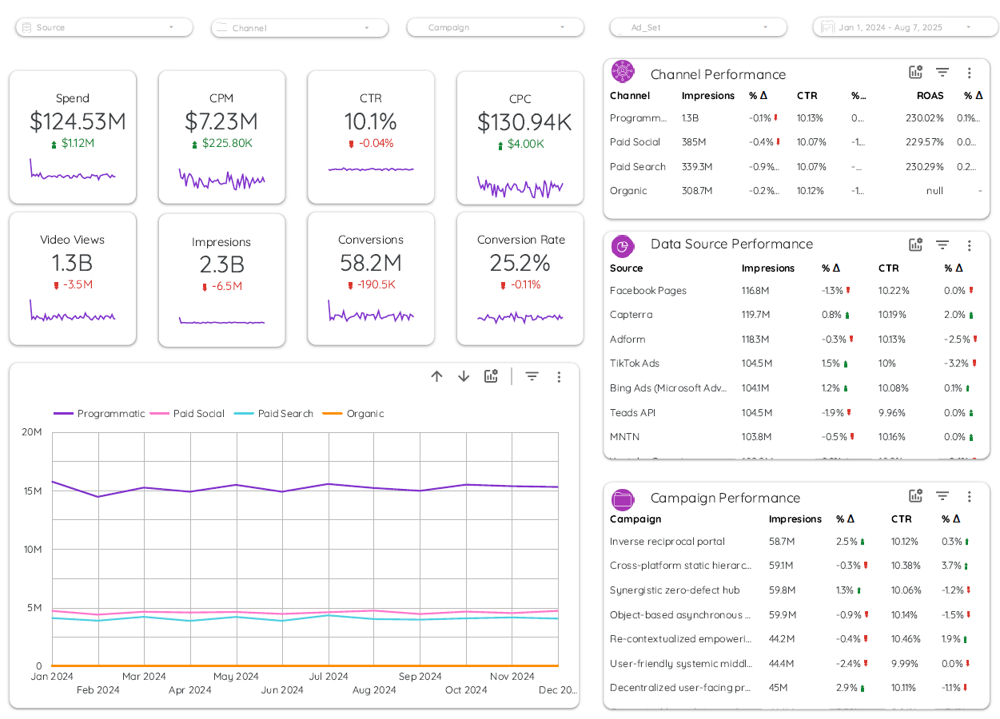

# Marketing Campaign Analytics – Looker Studio Dashboard

Este proyecto analiza datos de campañas publicitarias digitales (Programmatic, Amazon Ad Server, etc.), construyendo un dashboard interactivo en Looker Studio para evaluar rendimiento y optimización de la inversión.

## Dataset

Rows: daily records of advertising campaigns, data created synthetically in “data_dummy.py”
Main variables:
- Date → Campaign date
- Channel → Advertising channel (Programmatic, Social, etc.)
- Impressions → Impressions
- Clicks → Clicks on the ad
- Conversions → Conversions
- Spend → Investment (USD)
- Revenue → Revenue generated
- Source → Source platform (Amazon Ad Server, etc.)
- Campaign → Campaign name
- Video_Views → Video views
- Year, YearMonth → Time fields
- Ad_Set → Audience segment or ad group

## Dashboard objectives

- Measure campaign performance by channel and source.
- Calculate advertising efficiency metrics (CTR, CPA, ROI).
- Analyze monthly trends in investment, conversions, and revenue.
- Identify campaigns with the best return on investment.
- Visualize the distribution of clicks, conversions, and video views.

## KPIs to consider

- CTR (Click Through Rate):
Formula → CTR = (Clicks / Impressions) * 100
Indicates the percentage of people who clicked after seeing the ad.

- Conversion Rate (CVR):
Formula → CVR = (Conversions / Clicks) * 100
Measures the efficiency of clicks in generating conversions.

- CPC (Cost per Click):
Formula → CPC = Spend / Clicks
Shows you how much you are paying on average for each click.

- CPA (Cost per Acquisition):
Formula → CPA = Spend / Conversions
Average cost to achieve a conversion.

- ROAS (Return on Ad Spend):
Formula → ROAS = Revenue / Spend
Return for every dollar invested in the campaign.

## Report preview

